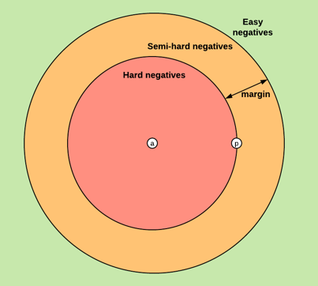

# Image Matching with Triplet Loss
Tensorflow implementation of Image Matching with Triplet Loss on the Tiny ImageNet dataset.


## 1. Introduction

### 1.1. Goal of the study

We want to create a model for the task of image matching data from the [Tiny ImageNet Visual Recognition Challenge dataset](https://paperswithcode.com/dataset/tiny-imagenet).

Image matching is a process in machine learning that involves finding similar images in a dataset. It can be used for a variety of applications, such as image retrieval, object recognition, and duplication detection.

We will implement a distance-based matching model based on *FaceNet: A Unified Embedding for Face Recognition and Clustering, Schroff et al., 2015* which introduced a state-of-the-art technique in face matching. Note that we will make the extra assumption that this technique can generalize to generic image matching.


### 1.2. Main files

- `hpt.py` is used to perform Hyperparameter Tuning (HPT)
- `train.py` is used to train a Feature Model (cf [Section 3.5](3.5. Feature Model))
- `evaluate_e2e_model.ipynb` is used to create and evaluate an ImageMatcher model


## 1.3. Environment setup

Create an environment with `python 3.10.8`  and run the following command to install the required dependencies:

```bash
pip install -r requirements.txt
```


## 2. Dataset

The Tiny ImageNet Visual Recognition Challenge dataset contains images from 200 different classes. Each image has a size of 64 * 64.

For the rest of the project, we will use a 70/20/10 ratio for the train/validation/test split.


## 3. Model Architecture

### 3.1. Siamese Network

The Siamese Network was first introduced in *Siamese Neural Networks for One-shot Image Recognition, Koch et al., 2015* and allows to compute similarity between 2 inputs. Therefore, image matching can be implemented by outputting  1 (for similar images) if and only if the output of the Siamese Network is greater than a given threshold.

As the name suggests, a Siamese network consists of 2 branches that share the same weights to ensure the symmetry of our distance measure. The branches are usually made of convolution layers. We picked a convolution system for 2 reasons:

- they are biased with the spatial distribution of images (i.e. pixel neighbors are likely to be correlated)
- they have much less weights than a equivalent dense feed-forward layer.

For our model, we can use a usual convolutional architecture like VGG-16, ResNet50 or Inception. Doing so will also allow to use transfer-learning to speed up our training.


<p align = "center"> <b>Diagram of a generic Siamese Network</b></p>


### 3.2. Triplet Loss

For the best performance, let's implement the Triplet Loss introduced in *FaceNet: A Unified Embedding for Face Recognition and Clustering, Schroff et al., 2015*.

**Goal:** We want to ensure that an image $x_i^a$ (*anchor*) of a specific class is closer to all other images  $x_i^p$ (*positive*) of the same person than it is to any image  $x_i^n$ (*negative*) of any other person. The following figure provides an example of valid triplet from our dataset:


Mathematically speaking, we want:

$$\forall\left(f\left(x_i^a\right), f\left(x_i^p\right), f\left(x_i^n\right)\right) \in \mathcal{T}, \ 
\left\|f\left(x_i^a\right)-f\left(x_i^p\right)\right\|_2^2+\alpha<\left\|f\left(x_i^a\right)-f\left(x_i^n\right)\right\|_2^2$$

with:

- $f$ the embedding function
- $\mathcal T$ the set of all valid triplets in the training set (note that the fact that a given example $x_i$ belongs to a triplet depends on its embedding hence on $f$ a priori)
- $\alpha$ the margin


<p align="center">
  
</p>

<p align = "center"> <b>Location of negatives with respect to a given anchor / positive pair in the 2D-space</b></p>

Hence, the triplet loss $L$ can be defined as the following function:

$$L = \sum_i^N\left[\left\|f\left(x_i^a\right)-f\left(x_i^p\right)\right\|_2^2-\left\|f\left(x_i^a\right)-f\left(x_i^n\right)\right\|_2^2+\alpha\right]$$


### 3.3. Feature Model

The Feature Model takes an image as input and outputs its embedding representation.

The architecture of the model is the following: 


<p align = "center"> <b>Architecture of the full Feature Model</b></p>


### 3.4. Image Matcher (E2E model)

The Image Matcher has a Siamese Network architecture as we expect the model to take 2 images as inputs.


<p align = "center"> <b>Architecture of the Image Matcher</b></p>


## 4. Model config

For clarity, every architecture / hyperparameter change will be done from a YAML configuration file. Here is an example of such config:

```yaml
experiment_name: "efficientnet_with_ff_block_test"

seed: 0
image_augmentation: False

feature_extractor: "efficientnet"
embedding_dim: 128
intermediate_ff_block_units: [512, 256]
dropout: 0.5

epochs: 50
early_stopping_patience: 10
```


## 5. Hyperparameter Tuning (HPT)

### 5.1. Run a HPT study

First, modify the `hpt_config.yaml` file and define the different hyperparameters you would like to try. Note that all fields from the 3rd sections define grids. The other parameters are fixed for all trials.

Run the following command to create an optuna HPT study.

```bash
python hpt.py --hpt-config-filepath hpt_config.yaml
```

The script will generate a `.db` file in `exp/hpt_studies`.  This file contains the information of our Hyperparameter Tuning.


### 5.2. Visualize the HPT study

To visualize the results of our HPT study, open the `hpt_visualizer.ipynb` notebook, fill the first cells accordingly and run all cells.


<p align = "center"> <b>Example of possible visualization for a HPT study</b></p>


## 6. Prediction example

First, let's predict the similarity score for 2 images picked in a valid triplet from the training set. As the triplet is likely to have been already seen by the model, we expect to have the anchor-positive score greater than the anchor-negative one by at least the default margin value of $\alpha = 1$.


```python
output_1 = image_matcher.predict(anchor, positive)
output_1

> <tf.Tensor: shape=(1,), dtype=float32, numpy=array([-0.03183275], dtype=float32)>
```

```python
output_2 = image_matcher.predict(anchor, negative)
output_2

> <tf.Tensor: shape=(1,), dtype=float32, numpy=array([-1.5196313], dtype=float32)>
```

```python
margin = 1
assert output_1 > output_2 + margin
print("The model is a priori well trained.")
```


To conclude, the model is *a priori* well trained and can at least capture the similarity signal for instances of our training set. Let's now evaluate the model generalization power on the test set.


## 7. Tensorflow Projector

[Tensorflow Projector](https://projector.tensorflow.org) is a useful tool for data exploration and visualization, particularly for high-dimensional data. It can help gain insights into their data and identify trends and patterns that may not be apparent in lower-dimensional projections. Therefore, we will use Tensorflow Projector to visualize a 3D representation of our embeddings. If the model is trained correctly, then similar images should be close to each other.


<p align = "center"> <b>Screenshot of the Tensorflow Projector UI with the enbeddings obtained with our approach</b></p>


To use it yourself, open the following [link](http://projector.tensorflow.org/?config=https://raw.githubusercontent.com/tonywu71/image-matching-triplet-loss/edit-report/projector/efficientnet_ffblocks_2_emb_1024/projector_config.json) in your internet browser.


## 8. Conclusion

We have implemented an end-to-end machine learning model that is able to tell if two images are similar. This model has various applications, such as image retrieval, object recognition, and duplication detection. The project we designed is all the more interesting that the whole training process is data-agnostic *i.e.* the Image Matcher can be easily retrained for another dataset.
