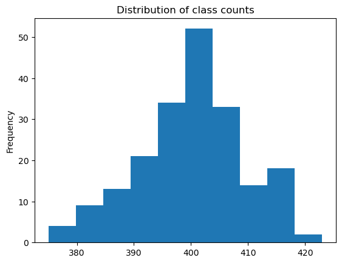

# Image Matching - Report

Candidate number: K5013


[TOC]

## Introduction

We want to create a model for the task of image matching data from the [Tiny ImageNet Visual Recognition Challenge dataset](https://paperswithcode.com/dataset/tiny-imagenet).


## Network architecture

### Siamese Network

The Siamese Network was first introduced in *Siamese Neural Networks for One-shot Image Recognition, Koch et al., 2015* and allows to compute similarity between 2 inputs. Therefore, image matching can be implemented by outputting  1 (for similar images) if and only if the output of the Siamese Network is greater than a given threshold.

As the name suggests, a Siamese network consists of 2 branches that share the same weights to ensure the symmetry of our distance measure. The branches are usually made of convolution layers. We picked a convolution system for 2 reasons:

- they are biased with the spatial distribution of images (i.e. pixel neighbors are likely to be correlated)
- they have much less weights than a equivalent dense feed-forward layer.

For our model, we can use a usual convolutional architecture like VGG-16, ResNet50 or Inception. Doing so will also allow to use transfer-learning to speed up our training.


## Loss

**Goal:** We want to ensure that an image $x_i^a$ (*anchor*) of a specific class is closer to all other images  $x_i^p$ (*positive*) of the same person than it is to any image  $x_i^n$ (*negative*) of any other person.


Mathematically speaking, we want:
$$
\forall\left(f\left(x_i^a\right), f\left(x_i^p\right), f\left(x_i^n\right)\right) \in \mathcal{T}, \ 
\left\|f\left(x_i^a\right)-f\left(x_i^p\right)\right\|_2^2+\alpha<\left\|f\left(x_i^a\right)-f\left(x_i^n\right)\right\|_2^2
$$
with:

- $f$ the embedding function
- $\mathcal T$ the set of all valid triplets in the training set (note that the fact that a given example $x_i$ belongs to a triplet depends on its embedding hence on $f$ a priori)
- $\alpha$ the margin


Hence, the triplet loss $L$ can be defined as the following function:
$$
L = \sum_i^N\left[\left\|f\left(x_i^a\right)-f\left(x_i^p\right)\right\|_2^2-\left\|f\left(x_i^a\right)-f\left(x_i^n\right)\right\|_2^2+\alpha\right]
$$


## Metrics

The main metric we will use is the ROC AUC which stands for Receiver Operating Characteristic's Area Under the Curve. This metric is suitable for classification tasks and is graph showing the performance of a classification model at all classification thresholds.
Moreover, plotting the ROC curve will help to understand the tradeoff between the True Positive Rate (TPR) and the False Positive Rate (FPR). Eventually and depending on the real-world application of our model, we will pick a threshold (e.g. for face recognition we might prefer that all positive guesses are correct even though we might miss a few similar face pairs).


If we set a threshold, then we can also consider the confusion matrix as a second metric.


## Implementation

The previously described model uses hard negatives for the triplet loss: we will refer it as a hard triplet loss.

The first way to produce such triplets is to search through the whole datasets for these hard negatives. Even worse, this has to be done before each epoch as the change in weights implies a change in which example is a hard negative. This procedure is called offline triplet mining and is clearly not efficient. 


Instead, we will use a different method called online triplet mining which was also introduced in *FaceNet: A Unified Embedding for Face Recognition and Clustering, Schroff et al., 2015*. Not only is this approach faster, but it also the easiest way to implement it using Tensorflow's `tfa.losses.TripletSemiHardLoss()` function. What this functions does is finding these the semi-hard negatives in each batch which are defined by the examples $n$ such that $d(a, p) < d(a, n) < d(a, p) + margin$.


On top of that,  `tfa.losses.TripletSemiHardLoss()`  works with a single feature extractor so there is no need to create the Siamese Network for the training.


**Note:** Nonetheless, it will be necessary to build a Siamese Network when we will implement our end-to-end model as we expect the latter to take 2 images as inputs.


## Training procedure

### Dataset

#### Introduction

The Tiny ImageNet Visual Recognition Challenge dataset contains images from 200 different classes. Each image has a size of 64 * 64.


#### Class Distribution

For a classification task, the first thing to do is to assess if there is some class imbalance. 



<p align = "center"> <b>Fig. ????</b></p>

We can see on the above-plotted histogram that all classes have a number of examples between 370 and 420 while most of them have 400 examples. Thus, there is but little class imbalance.


#### Data split

#TODO: Implement train/val/test split


#### Data Augmentation

According to figure ???, each class has a number of examples close to 400 which is quite little. One solution is to implement Data Augmentation. In other words, we will perform random transformations of our training image while keeping the same label. Doing so will drastically increase the number of examples per class while making the model much more robust.


In Tensorflow, data augmentation is built-in in one of the model's layer itself which is implemented by the following code in `models/preprocessing.py`:

```python
def get_image_augmentation_layer() -> tf.keras.layers.Layer:    
    list_layers = [
            tf.keras.layers.RandomZoom(0.3),
            tf.keras.layers.RandomFlip("horizontal"),
            tf.keras.layers.RandomRotation(0.2),
            tf.keras.layers.RandomTranslation(height_factor=0.2, width_factor=0.2),
            tf.keras.layers.RandomBrightness(0.2),
            tf.keras.layers.RandomContrast(0.2)
        ]
    
    image_augmentation = tf.keras.Sequential(
        list_layers,
        name="image_augmentation",
    )
    
    return image_augmentation
```


## Tensorflow Projector

One way to visually assess that our model is correctly trained is to use [Tensorflow Projector](https://projector.tensorflow.org) to visualize a 3D representation of our embeddings. If the model is trained correctly, then similar images should be close to each other.

[insert different screenshots]
