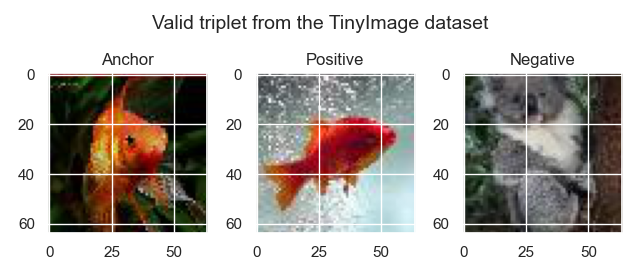

# Image Matching - Report

Candidate number: K5013


[TOC]


## TODO:

- [ ] ...


<div style="page-break-after: always;"></div>

## 1. Introduction

We want to create a model for the task of image matching data from the [Tiny ImageNet Visual Recognition Challenge dataset](https://paperswithcode.com/dataset/tiny-imagenet).

Image matching is a process in machine learning that involves finding similar images in a dataset. Image matching can be used for a variety of applications, such as image retrieval, object recognition, and duplication detection.

There are several approaches to image matching in machine learning, including:

1. Feature-based matching: In this approach, images are represented as sets of features, such as points, lines, or corners, and matching is performed based on the similarity of these features.
2. Distance-based matching: In this approach, images are represented as vectors in a high-dimensional space and matching is performed based on the distance between the vectors.
3. Hash-based matching: In this approach, images are represented as hashes, which are compact, fixed-length representations of the images. Matching is performed by comparing the hashes of the images.
4. Deep learning-based matching: In this approach, images are fed into a convolutional neural network (CNN) trained to recognize patterns in the images. Matching is performed based on the output of the CNN.

We will implement a distance-based matching model based on the ??? Paper which introduced a state-of-the-art technique in ???2019.


<div style="page-break-after: always;"></div>

## 2. Dataset

### 2.1. Introduction

The Tiny ImageNet Visual Recognition Challenge dataset contains images from 200 different classes. Each image has a size of 64 * 64.


### 2.2. Class Distribution

For a classification task, the first thing to do is to assess if there is some class imbalance. 


<p align = "center"> <b>Fig. ????</b></p>

We can see on the above-plotted histogram that all classes have a number of examples between 370 and 420 while most of them have 400 examples. Thus, there is but little class imbalance. Hence, we won't have to downsample or upsample some of our classes.


### 2.3. Data split

#TODO: Implement train/val/test split


### 2.4. Data Augmentation

According to figure ???, each class has a number of examples close to 400 which is quite little. One solution is to implement Data Augmentation. In other words, we will perform random transformations of our training image while keeping the same label. Doing so will drastically increase the number of examples per class while making the model much more robust.


In Tensorflow, data augmentation is built-in in one of the model's layer itself which is implemented by the following code in `models/`:

```python
def get_image_augmentation_layer() -> tf.keras.layers.Layer:    
    list_layers = [
            tf.keras.layers.RandomZoom(0.3),
            tf.keras.layers.RandomFlip("horizontal"),
            tf.keras.layers.RandomRotation(0.2),
            tf.keras.layers.RandomTranslation(height_factor=0.2, width_factor=0.2),
            tf.keras.layers.RandomBrightness(0.2),
            tf.keras.layers.RandomContrast(0.2)
        ]
    
    image_augmentation = tf.keras.Sequential(
        list_layers,
        name="image_augmentation",
    )
    
    return image_augmentation
```


**Note:** There is a known issue on the [Tensorflow Github respository](https://github.com/keras-team/keras-cv/issues/581) about a significant slow down in performance when using image augmentation layers. For this reason, we will keep the `image_augmentation` option in our model to `False` but this feature is fully-functional in our project.


<div style="page-break-after: always;"></div>

## 3. Model Architecture

### 3.1. Siamese Network

The Siamese Network was first introduced in *Siamese Neural Networks for One-shot Image Recognition, Koch et al., 2015* and allows to compute similarity between 2 inputs. Therefore, image matching can be implemented by outputting  1 (for similar images) if and only if the output of the Siamese Network is greater than a given threshold.

As the name suggests, a Siamese network consists of 2 branches that share the same weights to ensure the symmetry of our distance measure. The branches are usually made of convolution layers. We picked a convolution system for 2 reasons:

- they are biased with the spatial distribution of images (i.e. pixel neighbors are likely to be correlated)
- they have much less weights than a equivalent dense feed-forward layer.

For our model, we can use a usual convolutional architecture like VGG-16, ResNet50 or Inception. Doing so will also allow to use transfer-learning to speed up our training.


### 3.2. Loss

**Goal:** We want to ensure that an image $x_i^a$ (*anchor*) of a specific class is closer to all other images  $x_i^p$ (*positive*) of the same person than it is to any image  $x_i^n$ (*negative*) of any other person.

This is an example of valid triplet from our dataset:



Mathematically speaking, we want:
$$
\forall\left(f\left(x_i^a\right), f\left(x_i^p\right), f\left(x_i^n\right)\right) \in \mathcal{T}, \ 
\left\|f\left(x_i^a\right)-f\left(x_i^p\right)\right\|_2^2+\alpha<\left\|f\left(x_i^a\right)-f\left(x_i^n\right)\right\|_2^2
$$
with:

- $f$ the embedding function
- $\mathcal T$ the set of all valid triplets in the training set (note that the fact that a given example $x_i$ belongs to a triplet depends on its embedding hence on $f$ a priori)
- $\alpha$ the margin


Hence, the triplet loss $L$ can be defined as the following function:
$$
L = \sum_i^N\left[\left\|f\left(x_i^a\right)-f\left(x_i^p\right)\right\|_2^2-\left\|f\left(x_i^a\right)-f\left(x_i^n\right)\right\|_2^2+\alpha\right]
$$


### 3.3. Online TripletLoss

The previously described model uses hard negatives for the triplet loss: we will refer it as a hard triplet loss.

The first way to produce such triplets is to search through the whole datasets for these hard negatives. Even worse, this has to be done before each epoch as the change in weights implies a change in which example is a hard negative. This procedure is called offline triplet mining and is clearly not efficient. 

Instead, we will use a different method called online triplet mining which was also introduced in *FaceNet: A Unified Embedding for Face Recognition and Clustering, Schroff et al., 2015*. Not only is this approach faster, but it also the easiest way to implement it using Tensorflow's `tfa.losses.TripletSemiHardLoss()` function. What this functions does is finding these the semi-hard negatives in each batch which are defined by the examples $n$ such that $d(a, p) < d(a, n) < d(a, p) + margin$.

On top of that,  `tfa.losses.TripletSemiHardLoss()`  works with a single feature extractor so there is no need to create the Siamese Network for the training.


**Note:** Nonetheless, it will be necessary to build a Siamese Network when we will implement our end-to-end model as we expect the latter to take 2 images as inputs.


### 3.4. Feature Extractor and Transfer Learning

Transfer learning is a machine learning technique where a model trained on one task is re-purposed on a second related task. Transfer learning is useful when the second task has a limited amount of labeled data, or when the data distribution between the two tasks is significantly different.

In our case study, we will use transfer learning to avoid having to train our model from scratch as we only have limited computing power.

Note that there are two main approaches to transfer learning: feature-based and fine-tuning. In feature-based transfer learning, the pre-trained model is used as a fixed feature extractor, where the output of the pre-trained model's layers are fed into a new model that is trained to perform the target task. For the sake of simplicity, we will stick to a feature-based transfer for our Image Matcher task.

Tensorflow Hub is a repository of trained machine learning models ready to use. We will use it to get our fixed feature extractor.


We tried [ResNet50](https://tfhub.dev/tensorflow/resnet_50/feature_vector/1) and [EfficientNet](https://tfhub.dev/google/collections/efficientnet/1) as our feature extractor. After many experiments, we observed that `EfficientNet` is both more performant and quicker to train. Hence, we will make our transfer learning from EfficientNet.

Note that the user can use any other feature extractor by adding the corresponding TfHub link in the `TF_HUB_MODELS` constant in `models/feature_model.py`. Here is a snippet of the script in question:

```python
TF_HUB_MODELS = {
    "resnet50": "https://tfhub.dev/tensorflow/resnet_50/feature_vector/1",
    "efficientnet": "https://tfhub.dev/google/imagenet/efficientnet_v2_imagenet1k_b0/feature_vector/2"
}
IMAGE_SIZE_EFFICIENTNET = (224, 224)


def get_feature_extractor(model_name: str) -> tf.keras.Model:
    if model_name in TF_HUB_MODELS:
        feature_extractor = hub.KerasLayer(TF_HUB_MODELS[model_name], trainable=False)
    else:
        raise ValueError('Only "efficientnet" and "resnet50" are supported.')
    return feature_extractor
```


### 3.4. Feature Model

#### 3.4.1. From 3D to 2D with `Flatten`

The feature model obtained from TfHub returns a 3D tensor because of its convolutional nature. To process it any further, we will first use a `tf.keras.layers.Flatten`  layer to map it to a 2D tensor.

#### 3.4.2. Feed-Forward Blocks

Next, we will add some intermediate feed-forward blocks to increase the depth of our network and hopefully get better performance. A feed-forward block is a custom layer defined by the following class in `models/ff_block.py`:

```python
class FFBlock(tf.keras.layers.Layer):
    def _build_layer(self):
        list_layers = [
            tf.keras.layers.Dense(units=self.units),
            tf.keras.layers.BatchNormalization(),
            tf.keras.layers.ReLU(),
            tf.keras.layers.Dropout(self.dropout)
        ]
        return tf.keras.Sequential(list_layers)
        
    
    def __init__(self, units: int, dropout: float=0.):
        super().__init__()
        
        self.units = units
        self.dropout = dropout
        
        self.layer = self._build_layer()
        

    def call(self, inputs):
        return self.layer(inputs)

    def get_config(self):
        base_config = super().get_config()
        return {
            **base_config,
            "units": self.units,
            "dropout": self.dropout
        }
```

In summary, a Feed-Forward block has the following sequential structure:


#### 3.4.3. Embedding and L2 normalization

#TOFILL: Add reference to the FaceNet Paper


```python
    list_layers.extend([
        tf.keras.layers.Dense(units=embedding_dim),
        tf.keras.layers.Lambda(lambda x: tf.math.l2_normalize(x, axis=1)) # L2 normalize embeddings for triplet loss
    ])
```

However, note that there is a tradeoff for the number of units / embedding dimension of the final dense layer:

- On the one hand, the higher the embedding dimension and the more information the model will be able to encode
- On the other hand, if we choose an embedding space of high dimensions, the L2 distance between two points will tend to increase as the number of dimensions increases. This phenomenon is known as the "curse of dimensionality."

It is hard to assess which value of `embedding_dim` provides the best performance for our model. Therefore, we will perform a Hyperparameter Tuning in [Section 5](#5. Hyperparameter Tuning (HPT)) to pick its optimal value.


#### 3.4.4. Complete architecture


### 3.5. Metrics

The main metric we will use is the ROC AUC which stands for Receiver Operating Characteristic's Area Under the Curve. This metric is suitable for classification tasks and is graph showing the performance of a classification model at all classification thresholds.
Moreover, plotting the ROC AUC curve will help to understand the tradeoff between the True Positive Rate (TPR) and the False Positive Rate (FPR). Eventually and depending on the real-world application of our model, we will pick a threshold (e.g. for face recognition we might prefer that all positive guesses are correct even though we might miss a few similar face pairs).

If we set a threshold, then we can also consider the confusion matrix as a second metric.


<div style="page-break-after: always;"></div>

## 4. Model Training

### 4.1. Model configs

For clarity, every architecture / hyperparameter change will be done from a YAML configuration file. Here is an example of such config:

```yaml
experiment_name: "efficientnet_with_ff_block"

seed: 0
image_augmentation: False

feature_extractor: "efficientnet"
embedding_dim: 128
intermediate_ff_block_units: [512, 256]
dropout: 0.5

epochs: 50
early_stopping_patience: 10
```


### 4.?. Early Stopping

#TOFILL

Early Stopping is motivated by 2 reasons:

- We need a criterion to stop the training in time. The reason is that if the number of epochs is too big, the model can overfit on the training set
- We want the Hyperparameter Tuning to be as fast as possible


<div style="page-break-after: always;"></div>

## 5. Hyperparameter Tuning (HPT)

Hyperparameter Tuning is based on [Optuna](https://optuna.org/). In this Python module the algorithm used to find the optimal set of hyperparameters is the Tree-Parzen Estimator. Ro keep it simple, the Tree-Parzen Estimator is based on the idea of Bayesian optimization, which involves iteratively sampling the hyperparameter space and updating a probabilistic model to guide the search towards promising regions of the space.

To use Optuna for hyperparameter optimization, we first define the hyperparameter space and the objective function, and then create a study object. We then call the study's optimize method to begin the optimization process. The optimize method will repeatedly call the objective function with different hyperparameter configurations, using the sampler to generate the configurations and the pruner to decide whether to terminate a trial early. The optimize method will return the best hyperparameter configuration found by the optimization process.

Note that one **study** refers to one run of HPT and that one study is composed of several **trials** where each trial corresponds to one specific set of hyperparameters.


The validation set is obtained from the original full test set.


### 5.1. Run a HPT study

First, modify the `hpt_config.yaml` file and define the different hyperparameters you would like to try. Note that all fields from the 3rd sections define grids. The other parameters are fixed for all trials.

Run the following command to create an optuna HPT study.

```python
python hpt.py #TOFILL
```

The script will generate a `.db` file in `exp/hpt_studies`.  This file contains the information of our Hyperparameter Tuning.


### 5.2. Visualize the HPT study

To visualize the results of our HPT study, open the `hpt_visualizer.ipynb` notebook, fill the first cells accordingly and run all cells.

The following figures are taken from the previously mentioned notebook for this HPT config file:

```yaml
#TOFILL
```


The complete HPT results are summarized in a table in the [Appendix](#6. Appendix) section.


#### Best set of hyperparameters

After 50 trials, the best configuration for our model is the following:

```
#TOFILL
```


#### Optimization History

#INSERT_IMG

**Observations:**

- We can see that the more trials, the better objective value in general. This is because our Bayesian Optimization draws a set of hyperparameters according to the previous trials. For instance, it learns which specific value of a given hyperparameter gives a good model and often picks it in consequence.


#### Slice plot

#INSERT_IMG

**Observations:**

- `batch_size` is optimal for a value of `32`. This is because the greater the batch size, the more accurate each gradient descent iteration is
- `clip_grad_norm` is optimal when set to `true`. The reason why is that backpropagation-through-time often leads to vanishing or exploding gradients with LSTM layers (cf [subsection 3.1.1](###3.1.1. Exercise - regularization) on regularization)
- `dropout` is optional for low values. We can guess that the model is not very likely to overfit, hence a strong dropout will only slow down the training without brining much to the table
- `lr` (learning rate) and `lr_scheduler` are constant here
- `model_dims` and `num_layers` being deeply related (as they both impact the LSTM layer), we will analyze them separately in the following plot
- `optimizer` is optional with Adam


#### Parallel Coordinate

Another way to visualize the individual impact of each parameter is through a Parallel Coordinate plot. Note that the observations are exactly the same compared to the previous Slice Plot.

#INSERT_IMG


#### Contour plot

Let's analyze the relationship between model width and depth.

#INSERT_IMG

**Observations:**

- Surprisingly enough, models with a high number of parameters (high `model_dims` and `num_layers`) give poor results. Thus, there is a tradeoff between width and depth
- Contrarily to what the instructions said with *it is sometimes observed that having a wider LSTM layer is more beneficial than having deeper stacked LSTM layers*, it appears that the opposite holds true for our model


#### Hyperparameter Importances

#INSERT_IMG

**Observations:**

- `optimizer` is undoubtedly the most important hyperparameter. This can be easily explained by looking at the Slice Plot: all trials with `sgd` have a drastically worse validation loss that the ones with `adam`


#### Duration Importance for Hyperparameters

#INSERT_IMG

**Observations:**

- `model_dims` - i.e. the number of units per LSTM layer - is the hyperparameter with the most significant impact of duration. This is because not only the greater `model_dims` the more parameters in our model but also because the computation time is proportional to the sequence length (which is not the case of the Feed-Forward layer)


<div style="page-break-after: always;"></div>

## 6. Tensorflow Projector

[Tensorflow Projector](https://projector.tensorflow.org) is a useful tool for data exploration and visualization, particularly for high-dimensional data. It can help gain insights into their data and identify trends and patterns that may not be apparent in lower-dimensional projections. Therefore, we will use Tensorflow Projector to visualize a 3D representation of our embeddings. If the model is trained correctly, then similar images should be close to each other.

[insert different screenshots]


<div style="page-break-after: always;"></div>

## 7. Conclusion


<div style="page-break-after: always;"></div>

## 8. Appendix


