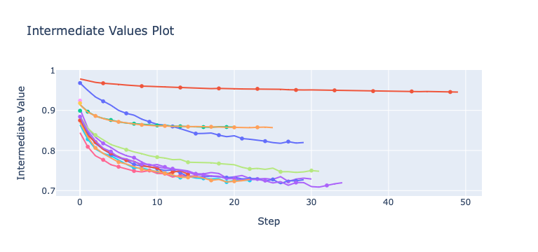

# Image Matching - Report

Candidate number: K5013


[TOC]

<div style="page-break-after: always;"></div>

## TODO

- [ ] Train from HPT result
- [ ] Run E2E and jot down the final AUC
- [ ] Run Tensorflow Projector


## 1. Introduction

### 1.1. Goal of the study

We want to create a model for the task of image matching data from the [Tiny ImageNet Visual Recognition Challenge dataset](https://paperswithcode.com/dataset/tiny-imagenet).

Image matching is a process in machine learning that involves finding similar images in a dataset. Image matching can be used for a variety of applications, such as image retrieval, object recognition, and duplication detection.

There are several approaches to image matching in machine learning, including:

1. Feature-based matching: In this approach, images are represented as sets of features, such as points, lines, or corners, and matching is performed based on the similarity of these features.
2. Distance-based matching: In this approach, images are represented as vectors in a high-dimensional space and matching is performed based on the distance between the vectors.
3. Hash-based matching: In this approach, images are represented as hashes, which are compact, fixed-length representations of the images. Matching is performed by comparing the hashes of the images.
4. Deep learning-based matching: In this approach, images are fed into a convolutional neural network (CNN) trained to recognize patterns in the images. Matching is performed based on the output of the CNN.

We will implement a distance-based matching model based on *FaceNet: A Unified Embedding for Face Recognition and Clustering, Schroff et al., 2015* which introduced a state-of-the-art technique in face matching. Note that we will make the extra assumption that this technique can generalize to generic image matching.


### 1.2. Code repository

Particular care has been taken in making the code clean, efficient and modular.

#### 1.2.1. Main files

- `hpt.py` is used to perform Hyperparameter Tuning (HPT)
- `train.py` is used to train a Feature Model (cf [Section 3.4](3.4. Feature Model))
- `evaluate_e2e_model.ipynb` is used to create and evaluate an ImageMatcher model


#### 1.2.2. Environment setup

Create an environment with `python 3.10.8`  and run the following command to install the required dependencies:

```bash
pip install -r requirements.txt
```


<div style="page-break-after: always;"></div>

## 2. Dataset

### 2.1. Introduction

The Tiny ImageNet Visual Recognition Challenge dataset contains images from 200 different classes. Each image has a size of 64 * 64.


### 2.2. Class Distribution

For a classification task, the first thing to do is to assess if there is some class imbalance. 


<p align = "center"> <b>Fig. ????</b></p>

We can see on the above-plotted histogram that all classes have a number of examples between 370 and 420 while most of them have 400 examples. Thus, there is but little class imbalance. Hence, we won't have to downsample or upsample some of our classes.


### 2.3. Data split

The test set is only used to evaluate our model and not used during the training.

This guarantees 2 things that the model will not overfit on the test set. This could happen during the Hyperparameter Tuning or during the training because of the Early Stopping (cf [Section 4.3](###4.3. Early Stopping)).


### 2.4. Data Augmentation

According to figure ???, each class has a number of examples close to 400 which is quite little. One solution is to implement Data Augmentation. In other words, we will perform random transformations of our training image while keeping the same label. Doing so will drastically increase the number of examples per class while making the model much more robust.


In Tensorflow, data augmentation is built-in in one of the model's layer itself which is implemented by the following code in `models/`:

```python
def get_image_augmentation_layer() -> tf.keras.layers.Layer:    
    list_layers = [
            tf.keras.layers.RandomZoom(0.3),
            tf.keras.layers.RandomFlip("horizontal"),
            tf.keras.layers.RandomRotation(0.2),
            tf.keras.layers.RandomTranslation(height_factor=0.2, width_factor=0.2),
            tf.keras.layers.RandomBrightness(0.2),
            tf.keras.layers.RandomContrast(0.2)
        ]
    
    image_augmentation = tf.keras.Sequential(
        list_layers,
        name="image_augmentation",
    )
    
    return image_augmentation
```


**Note:** There is a known issue on the [Tensorflow Github respository](https://github.com/keras-team/keras-cv/issues/581) about a significant slow down in performance when using image augmentation layers. For this reason, we will keep the `image_augmentation` option in our model to `False` but this feature is fully-functional in our project.


<div style="page-break-after: always;"></div>

## 3. Model Architecture

### 3.1. Siamese Network

The Siamese Network was first introduced in *Siamese Neural Networks for One-shot Image Recognition, Koch et al., 2015* and allows to compute similarity between 2 inputs. Therefore, image matching can be implemented by outputting  1 (for similar images) if and only if the output of the Siamese Network is greater than a given threshold.

As the name suggests, a Siamese network consists of 2 branches that share the same weights to ensure the symmetry of our distance measure. The branches are usually made of convolution layers. We picked a convolution system for 2 reasons:

- they are biased with the spatial distribution of images (i.e. pixel neighbors are likely to be correlated)
- they have much less weights than a equivalent dense feed-forward layer.

For our model, we can use a usual convolutional architecture like VGG-16, ResNet50 or Inception. Doing so will also allow to use transfer-learning to speed up our training.


### 3.2. Triplet Loss

For the best performance, let's implement the Triplet Loss introduced in *FaceNet: A Unified Embedding for Face Recognition and Clustering, Schroff et al., 2015*.

**Goal:** We want to ensure that an image $x_i^a$ (*anchor*) of a specific class is closer to all other images  $x_i^p$ (*positive*) of the same person than it is to any image  $x_i^n$ (*negative*) of any other person.

This is an example of valid triplet from our dataset:


<p align = "center"> <b>Fig. ????</b></p>

Mathematically speaking, we want:
$$
\forall\left(f\left(x_i^a\right), f\left(x_i^p\right), f\left(x_i^n\right)\right) \in \mathcal{T}, \ 
\left\|f\left(x_i^a\right)-f\left(x_i^p\right)\right\|_2^2+\alpha<\left\|f\left(x_i^a\right)-f\left(x_i^n\right)\right\|_2^2
$$
with:

- $f$ the embedding function
- $\mathcal T$ the set of all valid triplets in the training set (note that the fact that a given example $x_i$ belongs to a triplet depends on its embedding hence on $f$ a priori)
- $\alpha$ the margin


<p align = "center"> <b>Fig. ????</b></p>

Hence, the triplet loss $L$ can be defined as the following function:
$$
L = \sum_i^N\left[\left\|f\left(x_i^a\right)-f\left(x_i^p\right)\right\|_2^2-\left\|f\left(x_i^a\right)-f\left(x_i^n\right)\right\|_2^2+\alpha\right]
$$


### 3.3. Online TripletLoss

The previously described model uses hard negatives for the triplet loss: we will refer it as a hard triplet loss.

The first way to produce such triplets is to search through the whole datasets for these hard negatives. Even worse, this has to be done before each epoch as the change in weights implies a change in which example is a hard negative. This procedure is called offline triplet mining and is clearly not efficient. 

Instead, we will use a different method called online triplet mining which was also introduced in *FaceNet: A Unified Embedding for Face Recognition and Clustering, Schroff et al., 2015*. Not only is this approach faster, but it also the easiest way to implement it using Tensorflow's `tfa.losses.TripletSemiHardLoss()` function. What this functions does is finding these the semi-hard negatives in each batch which are defined by the examples $n$ such that $d(a, p) < d(a, n) < d(a, p) + \alpha$.

On top of that,  `tfa.losses.TripletSemiHardLoss()`  works with a single feature extractor so there is no need to create the Siamese Network for the training.

For all experiments, we will keep the default margin value of $\alpha = 1$.


**Note:** Nonetheless, it will be necessary to build a Siamese Network when we will implement our end-to-end model as we expect the latter to take 2 images as inputs.


### 3.4. Feature Extractor and Transfer Learning

Transfer learning is a machine learning technique where a model trained on one task is re-purposed on a second related task. Transfer learning is useful when the second task has a limited amount of labeled data, or when the data distribution between the two tasks is significantly different.

In our case study, we will use transfer learning to avoid having to train our model from scratch as we only have limited computing power.

Note that there are two main approaches to transfer learning: feature-based and fine-tuning. In feature-based transfer learning, the pre-trained model is used as a fixed feature extractor, where the output of the pre-trained model's layers are fed into a new model that is trained to perform the target task. For the sake of simplicity, we will stick to a feature-based transfer for our Image Matcher task.

Tensorflow Hub is a repository of trained machine learning models ready to use. We will use it to get our fixed feature extractor.


<p align = "center"> <b>Fig. ????</b></p>

We tried [ResNet50](https://tfhub.dev/tensorflow/resnet_50/feature_vector/1) and [EfficientNet](https://tfhub.dev/google/collections/efficientnet/1) as our feature extractor. After many experiments, we observed that `EfficientNet` is both more performant and quicker to train. Hence, we will make our transfer learning from EfficientNet.

Note that the user can use any other feature extractor by adding the corresponding TfHub link in the `TF_HUB_MODELS` constant in `models/feature_model.py`. Here is a snippet of the script in question:

```python
TF_HUB_MODELS = {
    "resnet50": "https://tfhub.dev/tensorflow/resnet_50/feature_vector/1",
    "efficientnet": "https://tfhub.dev/google/imagenet/efficientnet_v2_imagenet1k_b0/feature_vector/2"
}
IMAGE_SIZE_EFFICIENTNET = (224, 224)


def get_feature_extractor(model_name: str) -> tf.keras.Model:
    if model_name in TF_HUB_MODELS:
        feature_extractor = hub.KerasLayer(TF_HUB_MODELS[model_name], trainable=False)
    else:
        raise ValueError('Only "efficientnet" and "resnet50" are supported.')
    return feature_extractor
```


### 3.4. Feature Model

#### 3.4.1. From 3D to 2D with `Flatten`

The feature model obtained from TfHub returns a 3D tensor because of its convolutional nature. To process it any further, we will first use a `tf.keras.layers.Flatten`  layer to map it to a 2D tensor.


#### 3.4.2. Feed-Forward Blocks

Next, we will add some intermediate feed-forward blocks to increase the depth of our network and hopefully get better performance. A feed-forward block is a custom layer defined by the following class in `models/ff_block.py`:

```python
class FFBlock(tf.keras.layers.Layer):
    def _build_layer(self):
        list_layers = [
            tf.keras.layers.Dense(units=self.units),
            tf.keras.layers.BatchNormalization(),
            tf.keras.layers.ReLU(),
            tf.keras.layers.Dropout(self.dropout)
        ]
        return tf.keras.Sequential(list_layers)
        
    
    def __init__(self, units: int, dropout: float=0.):
        super().__init__()
        
        self.units = units
        self.dropout = dropout
        
        self.layer = self._build_layer()
        

    def call(self, inputs):
        return self.layer(inputs)

    def get_config(self):
        base_config = super().get_config()
        return {
            **base_config,
            "units": self.units,
            "dropout": self.dropout
        }
```

In summary, a Feed-Forward block has the following sequential structure:


<p align = "center"> <b>Fig. ????</b></p>


#### 3.4.3. Embedding and L2 normalization

Finally, we need to project our vectors to a vector space with the given embedding dimension. According to the *FaceNet* paper, we also want constrain this embedding to live on the d-dimensional hypersphere *i.e.*:
$$
\forall x \in \mathbb{R}^d,  \ \|f(x)\|_2=1
$$


Thus, we will implement the final layers of our feature model as such:

```python
    list_layers.extend([
        tf.keras.layers.Dense(units=embedding_dim),
        tf.keras.layers.Lambda(lambda x: tf.math.l2_normalize(x, axis=1)) # L2 normalize embeddings for triplet loss
    ])
```


Note that there is a tradeoff for the number of units / embedding dimension of the final dense layer:

- On the one hand, the higher the embedding dimension and the more information the model will be able to encode
- On the other hand, if we choose an embedding space of high dimensions, the L2 distance between two points will tend to increase as the number of dimensions increases. This phenomenon is known as the "curse of dimensionality."

It is hard to assess which value of `embedding_dim` provides the best performance for our model. Therefore, we will perform a Hyperparameter Tuning in [Section 5](#5. Hyperparameter Tuning (HPT)) to pick its optimal value.


#### 3.4.4. Complete architecture


<p align = "center"> <b>Fig. ????</b></p>


### 3.5. ImageMatcher (E2E model)

As previously mentioned at the end of [Section 3.3](3.3. Online TripletLoss), it is necessary to build a Siamese Network to implement our end-to-end model.


To create a E2E model, just create an instance of `ImageMatcher` with the previously trained Feature Model as its input. The following snippet of code goes into more details about how the Image Matcher was build with respect to the above graph.

```python
class ImageMatcher():
    def _create_e2e_model(self, feature_model: tf.keras.Model) -> tf.keras.Model:
        inputs = tf.keras.Input(shape=(2, *IMAGE_SIZE_EFFICIENTNET, 3))
        
        x_1 = feature_model(inputs[:, 0])  # type: ignore
        x_2 = feature_model(inputs[:, 1])  # type: ignore
        
        outputs = tf.keras.layers.Lambda(lambda x: - tf.norm(x[0] - x[1], ord='euclidean', axis=-1))([x_1, x_2])
        
        model = tf.keras.Model(inputs=inputs, outputs=outputs, name="image_matching")

        return model
        
    
    def __init__(self, model_filepath: str) -> None:
        self.feature_model = tf.keras.models.load_model(model_filepath, compile=False)
        self.model = self._create_e2e_model(feature_model=self.feature_model)  # type: ignore
        
        self.model.compile(metrics=[tf.keras.metrics.AUC(from_logits=True)])
        
        logger.info("Successfully created E2E model.")
    
    
    def __call__(self, dataset: tf.data.Dataset) -> tf.Tensor:
        return self.model(dataset)  # type: ignore
    
    
    def get_auc(self, dataset: tf.data.Dataset, steps: Optional[int]=None) -> float:
        _, auc = self.model.evaluate(dataset, steps=steps) # first element is the undefined loss
        return auc
    
    
    def predict(self, im_1, im_2) -> float:
        """Given two images, perform image pre-processing and returns the probability that
        these 2 images are similar.

        Returns:
            float
        """
        im_1 = preprocess_inputs(im_1)
        im_2 = preprocess_inputs(im_2)
        
        inputs = tf.stack([im_1, im_2], axis=0)
        
        inputs = tf.expand_dims(inputs, axis=0)
        
        return self.model(inputs)   # type: ignore
```


### 3.6. Metrics

The main metric we will use is the ROC AUC which stands for Receiver Operating Characteristic's Area Under the Curve. This metric is suitable for classification tasks and is graph showing the performance of a classification model at all classification thresholds.
Moreover, plotting the ROC AUC curve will help to understand the tradeoff between the True Positive Rate (TPR) and the False Positive Rate (FPR). Eventually and depending on the real-world application of our model, we will pick a threshold (*e.g.* for face recognition we might prefer that all positive guesses are correct even though we might miss a few similar face pairs).

Note that if a threshold is defined, then we will be able to consider the confusion matrix as a second metric.


<div style="page-break-after: always;"></div>

## 4. Training procedure

### 4.1. Model configs

For clarity, every architecture / hyperparameter change will be done from a YAML configuration file. Here is an example of such config:

```yaml
experiment_name: "efficientnet_with_ff_block"

seed: 0
image_augmentation: False

feature_extractor: "efficientnet"
embedding_dim: 128
intermediate_ff_block_units: [512, 256]
dropout: 0.5

epochs: 50
early_stopping_patience: 10
```


### 4.2. Optimizer

We will use the Adam optimizer (Adaptive Moment Estimation) as it is computationally efficient, easy to implement and known to perform well for many deep learning problems.

In particular, Adam is well-suited to our study case as it features:

- Adaptive learning rate: Adam uses separate learning rates for each parameter, and adapts the learning rate during training by using the first and second moments of the gradients. This helps the optimizer converge faster and more stably
- Momentum: Adam also utilizes moving average of the gradient called momentum which helps to smooth out the gradients and reduce oscillations in the optimizer's path.


### 4.3. Early Stopping

Early Stopping is motivated by 2 reasons:

- We need a criterion to stop the training in time. The reason is that if the number of epochs is too big, the model can overfit on the training set
- We want the Hyperparameter Tuning to be as fast as possible


<div style="page-break-after: always;"></div>

## 5. Hyperparameter Tuning (HPT)

Hyperparameter Tuning is based on [Optuna](https://optuna.org/). In this Python module the algorithm used to find the optimal set of hyperparameters is the Tree-Parzen Estimator. Ro keep it simple, the Tree-Parzen Estimator is based on the idea of Bayesian optimization, which involves iteratively sampling the hyperparameter space and updating a probabilistic model to guide the search towards promising regions of the space.

To use Optuna for hyperparameter optimization, we first define the hyperparameter space and the objective function, and then create a study object. We then call the study's optimize method to begin the optimization process. The optimize method will repeatedly call the objective function with different hyperparameter configurations, using the sampler to generate the configurations and the pruner to decide whether to terminate a trial early. The optimize method will return the best hyperparameter configuration found by the optimization process.

Note that one **study** refers to one run of HPT and that one study is composed of several **trials** where each trial corresponds to one specific set of hyperparameters.


### 5.1. Run a HPT study

First, modify the `hpt_config.yaml` file and define the different hyperparameters you would like to try. Note that all fields from the 3rd sections define grids. The other parameters are fixed for all trials.

Run the following command to create an optuna HPT study.

```bash
python hpt.py --hpt-config-filepath hpt_config.yaml
```

The script will generate a `.db` file in `exp/hpt_studies`.  This file contains the information of our Hyperparameter Tuning.


### 5.2. HPT results

After 15 trials, the best configuration for our model is the following:

```
Best trial until now:
 Value:  0.7195121049880981
 Params: 
    dropout: 0.3
    embedding_dim: 1024
    intermediate_ff_block_units: [512, 256]
```

The complete HPT results for each trial are summarized in the table in the [Appendix](#6. Appendix) section.


### 5.3. Visualize the HPT study

To visualize the results of our HPT study, open the `hpt_visualizer.ipynb` notebook, fill the first cells accordingly and run all cells.

The following figures are taken from the previously mentioned notebook for this HPT config file:

```yaml
study_name: "hpt_study-0"

seed: 0
image_augmentation: False  # due to https://github.com/keras-team/keras-cv/issues/581, image_augmentation must be 

feature_extractor: "efficientnet"
embedding_dim_grid: [128, 256, 512, 1024]
intermediate_ff_block_units_grid: ["[]", "[256]", "[256, 256]", "[512]", "[512, 256]", "[512, 512]", "[1024]", "[1024, 512]"]  # must be a list of strings for Optuna compatibility

epochs: 50
early_stopping_patience: 3

n_trials: 15
```


#### 5.3.1. Optimization history


<p align = "center"> <b>Fig. ????</b></p>

**Observations:**

- We can see that the more trials, the better objective value in average. This is because our Bayesian Optimization draws a set of hyperparameters according to the previous trials. For instance, it learns which specific value of a given hyperparameter gives a good model and often picks it in consequence.


#### 5.3.2. Intermediate plot



<p align = "center"> <b>Fig. ????</b></p>

**Observations:**

- We can see that most models stop learning before 35 epochs. Note that some trainings were pruned by *Optuna* as they were considered non-promising


#### 5.3.3. Slice plot


<p align = "center"> <b>Fig. ????</b></p>

**Observations:**

- `dropout` seems to be optimal when close to $0.3$ 
- `embedding_dim` is optimal for values close to $1024$. It might prove interesting to test higher values of the embedding dimensions in a further HPT study to see if we will improve the performance of our model or reach a plateau
- `intermediate_ff_block_units` seems to be optimal for a 2-layer structure. It is interesting to notice that the performance is not strictly increasing with respect to the number of parameters as `[1024, 512]` performs worse in average than `[512, 256]`


#### 5.3.4. Parallel plot

Another way to visualize the individual impact of each parameter is through a Parallel Coordinate plot. Note that the observations are exactly the same compared to the previous Slice Plot.


<p align = "center"> <b>Fig. ????</b></p>


#### 5.3.5. Contour plot

Let's analyze the relationship between the embedding dimension and the dropout value.


<p align = "center"> <b>Fig. ????</b></p>

**Observations:**

- The space region with the best interpolated objective value is where `embedding_dim` is close to $1024$ and `dropout` is close to $0.2$


#### 5.3.6. Hyperparameter importances


<p align = "center"> <b>Fig. ????</b></p>

**Observations:**

- `dropout` is the most important hyperparameter. Using the previous slice plot, we can hypothesize that a too strong value of dropout can prevent the model to correctly learn
- `intermediate_ff_block_units` is more important than `embedding_dim`. We can then assume that depth is a significant parameter for our model


#### 5.3.7. Duration importance for hyperparameters


<p align = "center"> <b>Fig. ????</b></p>

**Observations:**

- `intermediate_ff_block_units` is the hyperparameter with the most significant impact of duration. This was expected adding these blocks add a lot of parameters for our model to learn during each training


<div style="page-break-after: always;"></div>

## 6. FeatureModel training results

### 6.1. Learning curve

We trained our model on Amazon SageMaker Lab with a GPU until we the validation loss wouldn't decrease anymore. In total, the training lasted 4 hours.


<p align = "center"> <b>Fig. ????</b></p>


We can observe that the validation loss stops to decrease after roughly 100 epochs.


### 6.2. Tensorboard

TensorBoard is a web-based tool provided with TensorFlow that allows users to interactively visualize and explore TensorFlow runs and experiments. It can help you understand and debug your TensorFlow code, and it can also be used for monitoring performance and evaluating results.

It can be run by running the following code:

```bash
tensorboard --logdir logs/<model_experiment>
```

For instance, run the following to visualize the result of our Feature Model:

```bash
tensorboard --logdir logs/efficientnet_ffblocks_2_emb_1024
```


## 7. ImageMatcher results (E2E)

### 7.1. Model Summary

For reference, this is the ImageMatcher summary that match the graph from [Section 3.5](###3.5. ImageMatcher (E2E model)):

```
Model: "image_matching"
__________________________________________________________________________________________________
 Layer (type)                   Output Shape         Param #     Connected to                     
==================================================================================================
 input_1 (InputLayer)           [(None, 2, 224, 224  0           []                               
                                , 3)]                                                             
                                                                                                  
 tf.__operators__.getitem (Slic  (None, 224, 224, 3)  0          ['input_1[0][0]']                
 ingOpLambda)                                                                                     
                                                                                                  
 tf.__operators__.getitem_1 (Sl  (None, 224, 224, 3)  0          ['input_1[0][0]']                
 icingOpLambda)                                                                                   
                                                                                                  
 feature_model (Sequential)     (None, 1024)         6972752     ['tf.__operators__.getitem[0][0]'
                                                                 , 'tf.__operators__.getitem_1[0][
                                                                 0]']                             
                                                                                                  
 lambda (Lambda)                (None,)              0           ['feature_model[0][0]',          
                                                                  'feature_model[1][0]']          
                                                                                                  
==================================================================================================
Total params: 6,972,752
Trainable params: 1,051,904
Non-trainable params: 5,920,848
__________________________________________________________________________________________________
```


### 7.2. Prediction example

First, let's predict the similarity score for 2 images picked in a valid triplet from the training set. As the triplet is likely to have been already seen by the model, we expect to have the anchor-positive score greater than the anchor-negative one by at least the default margin value of $\alpha = 1$.


Let's use the same triplet that was shown in [Section 3.2](###3.2. Triplet Loss):


```python
output_1 = image_matcher.predict(anchor, positive)
output_1

> <tf.Tensor: shape=(1,), dtype=float32, numpy=array([-0.03183275], dtype=float32)>
```

```python
output_2 = image_matcher.predict(anchor, negative)
output_2

> <tf.Tensor: shape=(1,), dtype=float32, numpy=array([-1.5196313], dtype=float32)>
```

```python
margin = 1
assert output_1 > output_2 + margin
print("The model is a priori well trained.")
```


To conclude, the model is *a priori* well trained and can at least capture the similarity signal for instances of our training set. Let's now evaluate the model generalization power on the test set.


### 7.3. Pairwise dataset

To ensure our model is compatible with Tensorflow's metrics, we will first have to create a `tf.data.Dataset` instance that yields all possible image pairs from the test set.

Here is our implementation:

```python
def get_generator_2_combination_from_datasets(dataset: tf.data.Dataset) -> Callable:
    ds_1 = dataset
    ds_2 = dataset
    
    def gen_2_combination_from_datasets():
        for x_1 in ds_1:
            for x_2 in ds_2:
                yield x_1, x_2
    
    return gen_2_combination_from_datasets


def match_mapping(x, y) -> Tuple[tf.Tensor, tf.Tensor]:
    (x_1, cls_1), (x_2, cls_2) = x, y
    return (tf.stack([x_1, x_2], axis=0), tf.cast(cls_1 == cls_2, dtype=tf.uint8))  # type: ignore


def get_pairwise_dataset(dataset: tf.data.Dataset, image_size: Tuple[int, int]) -> tf.data.Dataset:
    """Get the pairwise dataset for our end-to-end model. Note that the output Dataset is not batched.

    Args:
        data_generator (DataGenerator)
        image_size (Tuple[int, int])

    Returns:
        tf.data.Dataset
    """
    ds_pairs = tf.data.Dataset.from_generator(
        get_generator_2_combination_from_datasets(dataset=dataset),
        output_signature=(
              (
                  tf.TensorSpec(shape=(*image_size, 3), dtype=tf.float32),  # type: ignore
                  tf.TensorSpec(shape=(), dtype=tf.uint8)  # type: ignore
              ),
              (
                  tf.TensorSpec(shape=(*image_size, 3), dtype=tf.float32),  # type: ignore
                  tf.TensorSpec(shape=(), dtype=tf.uint8)  # type: ignore
              )
        ))
    
    ds_pairs = ds_pairs.map(match_mapping)
    
    return ds_pairs
```


Note that because the dataset is composed of all pairs of images from the test set, we will have $\binom{n}{2}$ instances with $n = Card(\text{testset})$. For $n=10000$, this would amount to $49995000$ examples. Therefore, we will only evaluate our model on a fraction of the test set by specifying the number of 32-example batches we want to use.


### 7.4. ROC AUC Curve


<p align = "center"> <b>Fig. ????: ROC AUC Curve for the final model evaluated on the first 32000 pairs of the test set</b></p>


We can see that out model performs much better than a random guess model which would have had a AUC of $0.5$. Hence, we can confidently validate the model's performance.


## 8. Tensorflow Projector

[Tensorflow Projector](https://projector.tensorflow.org) is a useful tool for data exploration and visualization, particularly for high-dimensional data. It can help gain insights into their data and identify trends and patterns that may not be apparent in lower-dimensional projections. Therefore, we will use Tensorflow Projector to visualize a 3D representation of our embeddings. If the model is trained correctly, then similar images should be close to each other.

[insert different screenshots]


<div style="page-break-after: always;"></div>

## 9. Conclusion

We have implemented an end-to-end machine learning model that is able to tell if two images are similar. This model has various applications, such as image retrieval, object recognition, and duplication detection. The project we designed is all the more interesting that the whole training process is data-agnostic *i.e.* the Image Matcher can be easily retrained for another dataset.


<div style="page-break-after: always;"></div>

## 10. Appendix

|      |  loss | dropout | embedding_dim | intermediate_ff_block_units |
| ---: | ----: | ------: | ------------: | :-------------------------- |
|    0 |  0.82 |     0.6 |           512 | [256, 256]                  |
|    1 | 0.946 |     0.9 |           512 | [256]                       |
|    2 | 0.858 |     0.8 |           256 | []                          |
|    3 | 0.729 |     0.3 |           512 | [256, 256]                  |
|    4 | 0.857 |     0.9 |           256 | []                          |
|    5 | 0.725 |     0.3 |           512 | [1024, 512]                 |
|    6 | 0.736 |       0 |           512 | [512, 512]                  |
|    7 | 0.748 |     0.2 |           128 | [512]                       |
|    8 | 0.924 |     0.7 |          1024 | [512]                       |
|    9 | 0.918 |       0 |           128 | []                          |
|   10 | 0.727 |     0.4 |          1024 | [1024, 512]                 |
|   11 | 0.741 |     0.4 |          1024 | [1024, 512]                 |
|   12 | 0.899 |     0.5 |          1024 | [1024, 512]                 |
|   13 |  0.72 |     0.3 |          1024 | [512, 256]                  |
|   14 | 0.728 |     0.2 |           512 | [512, 256]                  |


