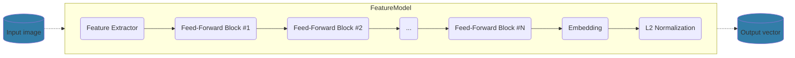

```mermaid
graph LR
  subgraph FeatureModel
  	direction LR
    A(Feature Extractor) --> B1(Feed-Forward Block #1) --> B2(Feed-Forward Block #2) --> B_others(...) -->BN(Feed-Forward Block #N) --> C(Embedding) --> D(L2 Normalization)
  end

input[(Input image)] -.-> FeatureModel -.-> output[(Output vector)]

classDef data fill:#327da8;
class input,output data;
```

